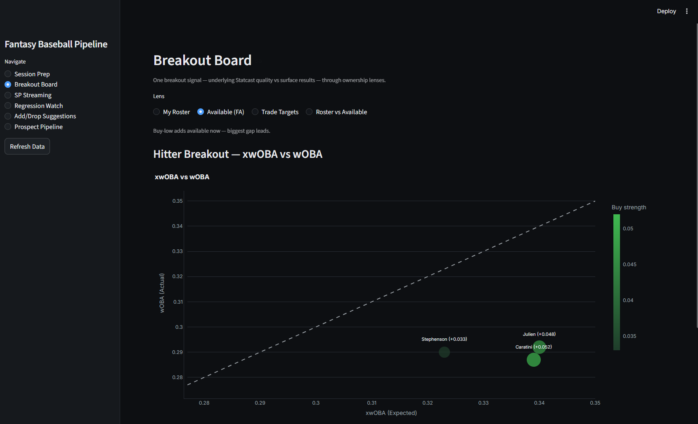
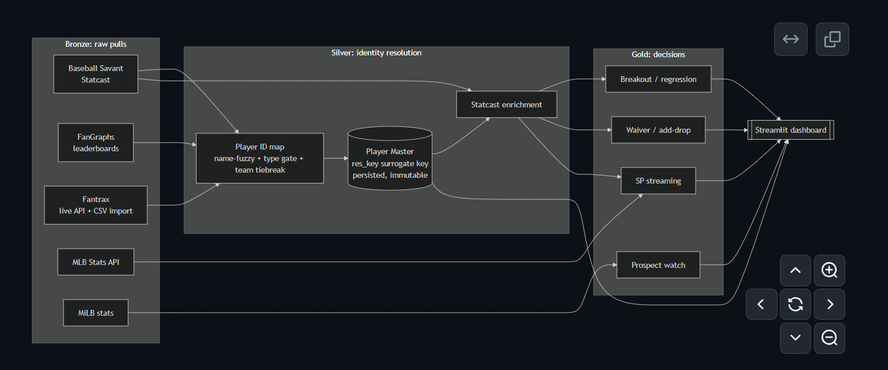
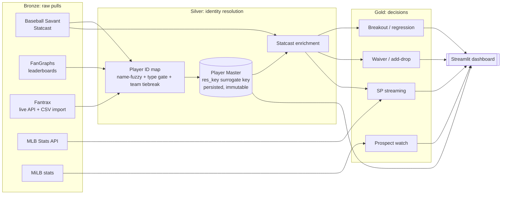
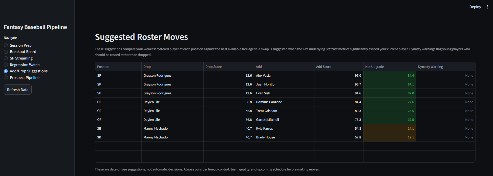
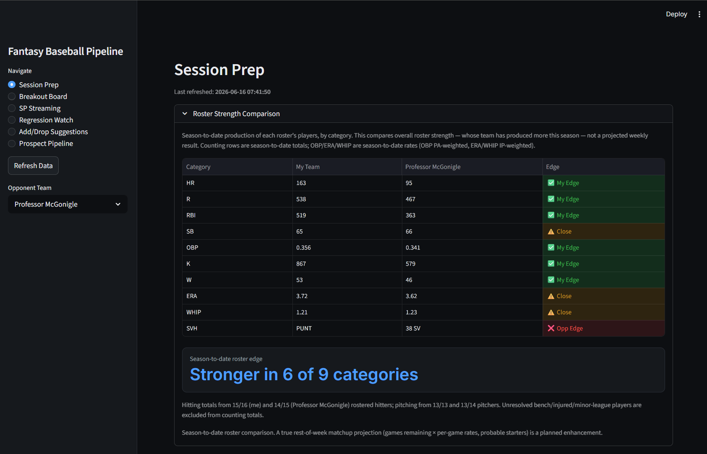
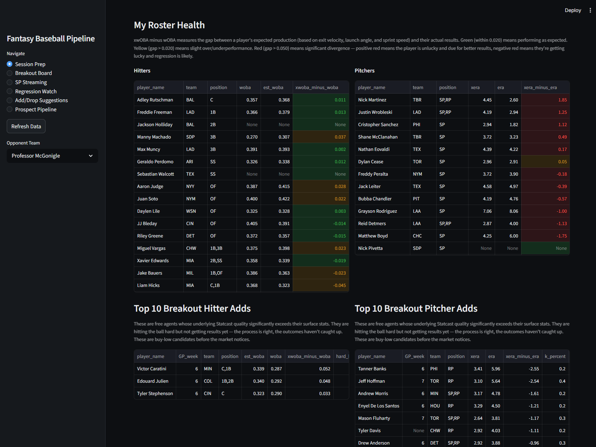
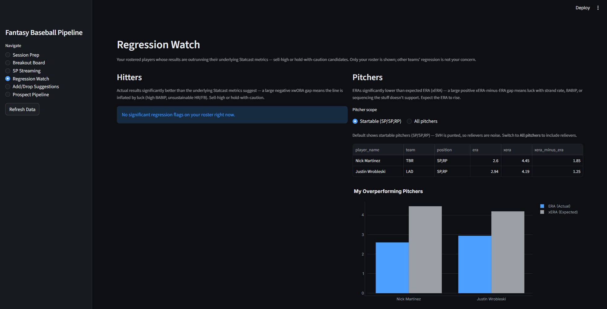

# Fantasy Baseball Pipeline

[](https://github.com/MileHighMorty/fantasy-baseball-pipeline/actions/workflows/ci.yml)

Python 3.10+ · pandas · rapidfuzz · pyarrow (parquet) · Streamlit · pytest · GitHub Actions

A local analytics pipeline that pulls dynasty fantasy baseball data from several
sources, resolves every player to a single stable identity across those sources,
and turns the result into weekly roster decisions through an interactive dashboard.

The hard part is not the baseball. The hard part is that the same player has a
different name or number in every system. He is "Shohei Ohtani" in one feed, the
number `660271` in a second, and "S. Ohtani" or "Ohtani, Shohei" in a third, and
nothing connects those records out of the box. Before you can compare a player's
expected production against his actual results, you have to be certain you are
looking at the same person in all three places. This project's centerpiece is the
layer that does that reliably, at scale, and survives the cases where careless
matching quietly maps two different people onto one.

That problem is not unique to baseball. Matching the same entity across systems
that share no common key is exactly what securities mastering does in finance:
the same bond or instrument carries a CUSIP in one system, an ISIN in another,
and a free-text description in a third, and a reference-data layer has to decide,
record by record, which of those are the same security. The technique here is the
same technique, applied to a domain where the answers are easy to eyeball and the
failure modes are easy to demonstrate.


*The Breakout Board plots underlying Statcast quality (xwOBA) against surface
results (wOBA). Points above the diagonal are producing less than their contact
quality says they should, so they read as buy-low. The free-agent lens shown here
filters to players you can actually add.*

## Architecture

The pipeline follows a bronze/silver/gold medallion design. Raw data lands in
bronze untouched, silver resolves identity and enriches, and gold produces the
decision outputs the dashboard reads.


*The medallion flow. Bronze pulls raw data, silver resolves player identity across
sources, gold turns the enriched data into decisions, and the dashboard reads gold.*

Static render above. The Mermaid source follows for anyone who wants to read or
edit it.



**Bronze** holds raw, date-stamped pulls and nothing else: Baseball Savant
(Statcast leaderboards), FanGraphs (batting and pitching leaderboards), the
Fantrax league (rostered players and the full free-agent pool, via the live API
with a manual CSV-export fallback on the same output contract), the MLB Stats API
(schedule and standings), and MiLB stats for tracked prospects. The layer fails
loudly on schema drift and never coerces silently.

**Silver** is where identity is resolved. The ID map fuzzy-matches every Fantrax
player to their Savant and FanGraphs records, and the persisted player master
assigns each resolved player a surrogate key that downstream tables join on. The
statcast enrichment step then joins expected-vs-actual metrics onto resolved
identities by vendor ID, not by name. The three analytical MLB sources (Savant,
FanGraphs, Fantrax) resolve through this map, and the MLB Stats probable-starter
feed now resolves through it too by way of the shared MLBAM id. The MiLB feed
shown in the diagram still flows straight to gold rather than through the map, for
the reason under known limitations below.

**Gold** turns enriched, identity-resolved data into decisions: breakout and
regression candidates, waiver-wire and add/drop rankings, starting-pitcher
streaming picks, and prospect call-up watches. Analytical thresholds live in the
gold modules alongside the logic that uses them.


*Suggested roster moves. For each position it compares my weakest rostered player
against the best available free agent by their underlying Statcast metrics, then
flags the swaps worth making.*

A **Streamlit dashboard** sits on top with six pages: Session Prep, Breakout
Board, SP Streaming, Regression Watch, Add/Drop Suggestions, and Prospect
Pipeline.


*Session Prep's Roster Strength Comparison. Season-to-date production of my roster
against a selected opponent across the nine scoring categories, with the rate
stats weighted correctly (OBP by plate appearances, ERA and WHIP by innings). It
measures overall roster strength, not a projected weekly score.*

## The identity-resolution layer

`silver/player_id_map.py` is the heart of the project. Its design is deliberately
narrow: one scored field, one hard gate, one tiebreaker.

**Name is the only fuzzy-scored field.** Matching uses `rapidfuzz`'s
`token_sort_ratio` on accent-stripped, whitespace-normalized names. Folding name,
team, and player type into one fuzzy string would blur the signal, because a
wrong-team exact name and a right-team wrong name could score identically, and the
resulting number would be uninterpretable.

**Player type is a hard gate.** Hitters only see batting-source candidates and
pitchers only see pitching-source candidates. This is what makes two-way players
correct rather than lucky: Shohei Ohtani appears under an identical name in both
the batting and pitching source files, so a single name-only pool would let his
hitter row match the pitching source at a perfect score. He gets two rows, one per
type, each matched only against its own pool.

**Team is a tiebreaker only.** When several candidates tie on the top score, the
one whose team matches wins. Team never rejects or penalizes a match, because
Savant carries no team column at all and FanGraphs team data goes stale between
pulls. As a scored field it would punish correct matches; as a tiebreaker it costs
nothing.

Every match also records its best candidate score even when that score falls below
the acceptance threshold, which lets unmatched players be split into meaningful
buckets: a near-miss where a real counterpart almost certainly exists, a
lower-confidence near-name that is often coincidental, and a genuine
"no candidate in this source" (a prospect, an IL stash, or a player below the
leaderboard's qualification floor).


*Per-player expected-vs-actual gaps (xwOBA minus wOBA) across the rostered
hitters. Every player here is matched back to a team and a stat line through the
identity layer, including the ones the qualified leaderboards miss.*

### Manual overrides that both force and block

When the matcher gets a name wrong, a human adds one row to
`overrides/player_name_overrides.csv` and the fix persists across every future
run. Overrides do two distinct jobs:

- **Force** a mapping by vendor ID, regardless of fuzzy score. Savant lists
  "José A. Ferrer" with an accent and a middle initial, which scored 88 and fell
  below the threshold; one override row pins the correct Savant ID. Same story for
  "Cam Schlittler," whom FanGraphs lists as "Cameron Schlittler."
- **Block** a mapping entirely with a `NONE` sentinel, for a name that scores well
  but is the wrong person. A blocked override can target a single source or all
  sources at once, since a non-entity is a non-entity everywhere.

### The surrogate key: `res_key`

`silver/data/player_master.csv` is the persistent registry. Each resolved player
receives `res_key`, a monotonically increasing integer assigned once at first
sight and never reused or renumbered. Downstream tables join on `res_key` so they
survive vendor-ID gaps, name respellings, and sources that arrive late. The master
currently holds 638 resolved players.

The concrete payoff: "Lance McCullers Jr." in Savant versus "Lance Mccullers Jr"
in the Fantrax feed (lowercase second `c`) is the same pitcher. Joined on name,
those are a coin flip; joined on the resolved key, they are one row
(`res_key` 572, carrying both the Savant and FanGraphs IDs). You resolve identity
once and then never match on names again.

## The honest metric: matchable vs raw

For the current rostered population (342 players), the combined match rate against
either source is:

| Measure | Rate |
| --- | --- |
| Raw (matched / all rostered) | 82% (280 / 342) |
| **Matchable (matched / players with a counterpart)** | **98% (280 / 285)** |

The gap between those two numbers is the point. The raw rate counts every
unmatched player as a failure, including the 57 players who genuinely have no row
in any leaderboard to match: minor leaguers, IL stashes, and players below the
qualification floor. Counting those against the matcher conflates *source
coverage* with *matcher accuracy*. The matchable rate excludes players the source
never carried, so it measures the only thing the matcher controls. Reporting the
raw 82% as the headline would understate accuracy; reporting 98% without
explaining the denominator would overstate coverage. The pipeline prints both, and
so does this README.

The per-source split shows the same effect more sharply. Savant matches 97.5% of
matchable rostered players; FanGraphs matches 98.8% of *its* matchable players but
only 50% of all rostered players, because the FanGraphs pull on disk is an
early-season snapshot whose leaderboard simply had not yet qualified most of the
roster. The matchable framing keeps that source-coverage gap from being misread as
a matcher defect.

## The scale-collision war story

The matcher was correct and safe on a roster of a few hundred players. Then the
free-agent pool was added, and the population jumped to roughly 9,500 names.

At that volume, fuzzy matching that had been perfectly reliable started producing
identity *collisions*. A minor-league free agent named "Joscar Hernandez" scored
high enough against the star "Teoscar Hernandez" to match him; a similar near-name,
"Stanly Alcantara," cleared the acceptance threshold at 90.3 against the real Sandy
Alcantara. Each of those is the matcher confidently mapping a non-entity onto a
real player. Left alone, the next run would have overwritten the real player's
vendor IDs in the master with the impostor's.

The fix is **master ID immutability**: once an identity is established in the
player master, an ID already on the row is never overwritten by a later
probabilistic match. New source IDs can fill in where a row was previously blank,
but an existing ID is treated as settled. Corrections to a wrong established
identity go through the override CSV, deliberately, as a human decision, not
through the next fuzzy pass. The "Joscar/Teoscar" and "Stanly/Sandy" cases are
pinned shut with blocking overrides.

The senior-engineer lesson is the general one: match confidence that is entirely
safe at small scale collides at volume, and the durable fix is not a higher
threshold (which would start dropping real matches) but making established
identity authoritative and corrections explicit.

## Testing

The suite runs **54 tests across two files**, covering the parts most likely to
break silently.

**`tests/test_player_id_map.py` — 48 tests on identity resolution:**

- **Normalization** of accents, two-way role suffixes, and whitespace, including
  that accents are preserved in the human-facing canonical name but stripped for
  matching.
- **Player-type classification** of single- and multi-eligibility position
  strings.
- **Score classification** at every bucket boundary, and sub-threshold near-miss
  capture.
- **Team tiebreaker** behavior, including that it stays inert when no team data is
  present.
- **Overrides**: force-match wins over any fuzzy score, block beats a high fuzzy
  score, pass-through when no override applies, and `source=all` expansion.
- **Master key stability and immutability**: keys are monotonic and assigned once,
  a rerun on the same players creates zero new keys, a two-way player gets two
  distinct keys, and an established ID is never overwritten.

**`tests/test_regression_breakout.py` — 6 tests on the gold buy/sell invariants:**

- **Sign convention**, pinning that the pitcher expected-vs-actual gap runs
  opposite to hitters, so a still-elite pitcher running lucky is never emitted as
  a sell.
- **The hard-hit OR-clause**, which once flagged directional buys as sells: an
  unlucky pitcher stays off the sell list even when his hard-hit percentile is
  high.
- **League-quality floors**, so "regression toward a still-elite level" is not a
  sell and "improvement to a still-below-average level" is not a buy, in both
  directions for hitters and pitchers.

```bash
# Windows (PowerShell)
.\venv\Scripts\python.exe -m pytest

# macOS / Linux
venv/bin/python -m pytest
```

CI runs this suite on Ubuntu against Python 3.10 and 3.12 on every push and pull
request.

## How to run

```bash
git clone <repo-url>
cd fantasy-baseball-pipeline

# Windows (PowerShell)
python -m venv venv
.\venv\Scripts\python.exe -m pip install -r requirements.txt

# macOS / Linux
python3 -m venv venv
venv/bin/python -m pip install -r requirements.txt

# Optional: copy .env.example to .env and add a FANTRAX_COOKIE for live pulls.
# Without it, the pipeline uses the manual Fantrax CSV-export path.

# Run the full bronze -> silver -> gold pipeline
.\venv\Scripts\python.exe -m scripts.weekly_refresh    # Windows
venv/bin/python -m scripts.weekly_refresh              # macOS / Linux

# Launch the dashboard
.\venv\Scripts\streamlit run dashboard\app.py          # Windows
venv/bin/streamlit run dashboard/app.py                # macOS / Linux
```

The refresh runs each layer in order and prints a timestamped summary after each
one. Individual module failures are caught and logged without killing the rest of
the run. The virtual environment is `venv`, not `.venv`.

The pipeline is developed and run on Windows with PowerShell; the test suite is
verified on Ubuntu against Python 3.10 and 3.12 in CI. The modules carry no
OS-specific branching — paths go through `pathlib`, and every file read and write
names its encoding explicitly — and the one Windows accommodation, a
`sys.stdout.reconfigure(errors="replace")` guard for team names whose emoji a
cp1252 console cannot encode, is inert elsewhere. What has not happened is an
end-to-end run on macOS or Linux: CI exercises the test suite, not the live data
pulls or the dashboard.


*Regression Watch, filtered to my own roster. These are my players whose results
are running ahead of their underlying metrics, so they read as sell-high or
hold-with-caution. When none of my hitters are flagged it says so instead of
padding the list with other teams' players.*

## Design decisions, known limitations, and next steps

This is an honest accounting of where the boundaries are.

### The path to production

Three gaps separate this pipeline from a production deployment. None is an
oversight; each is a scope decision with a known cost and a known next step.

**1. The surrogate key lives in a CSV, and that is the production boundary.**
`player_master.csv` is durable and correct across runs — the immutability rule
holds, keys are monotonic, and a rerun on the same players assigns zero new keys.
But that rule is enforced in application logic, which means it holds exactly as
long as every writer goes through that code path. Production enforces it in the
storage layer: the master in Postgres, `res_key` as the primary key, source IDs
under uniqueness constraints, and never-overwrite as a database constraint rather
than a Python guard. The migration itself is mechanical. What it buys is that a
careless writer fails loudly at the boundary instead of quietly corrupting an
identity.

**2. There is no orchestrator, and `weekly_refresh` is doing an orchestrator's
job.** The refresh script runs the layers in order, catches per-module failures,
and prints a timestamped summary. That is a sequential script standing in for a
scheduler, and the difference shows up precisely where this pipeline is most
fragile: there are no retries with backoff on the Cloudflare 403s that make the
FanGraphs pull go stale, no alerting when a module fails, no way to backfill one
date, and no dependency graph — a silver failure does not stop the gold modules
downstream of it from running against stale inputs and producing a confident,
wrong board. Production needs a real DAG. Dagster fits best, because its
software-defined-asset model maps directly onto bronze/silver/gold
materializations, and freshness policies turn today's printed staleness warning
into a failing check.

**3. It runs on one Windows machine, and everything it produces lands on local
disk.** Ingestion is genuinely networked — the Fantrax client authenticates
against the live API, and Savant, FanGraphs, and MLB Stats are all remote pulls —
but every artifact those pulls produce is written to a local directory, and the
schedule is "when I run it." That is the right cost for a personal
research tool and the wrong one for anything with users. The cloud shape is not
exotic: object storage in place of local `bronze/silver/gold` directories, the
master in managed Postgres, the orchestrator on a schedule instead of on my
laptop, and the dashboard deployed rather than launched with `streamlit run`. The
substantive work is not the infrastructure — it is that credential handling,
currently a `.env` holding Fantrax username, password, league ID, and session
cookie, has to become a managed secret with rotation.

Continuous integration is the first piece of this roadmap actually built rather
than planned: the test suite runs on every push and pull request against Python
3.10 and 3.12.

### Design decisions

- **The MLB Stats probable-starter feed resolves through the MLBAM id.** MLB Stats
  returns the MLBAM player id for each probable starter, which is the same key as
  `savant_player_id`, so SP streaming joins probables to their enriched Statcast row
  on that id rather than on name and team. The id join is robust to the accent and
  punctuation differences (Vásquez, Soriano) that the old string join quietly
  dropped.
- **The enriched Statcast tables build off the full Savant population.** The
  enrichment base was once the intersection of Savant and a FanGraphs snapshot,
  which the stale-FanGraphs fallback shrank to a fraction of the league (54 of 366
  pitchers). It now builds off the full Savant population and treats FanGraphs as an
  optional left join bridged through `player_id_map`: pitchers went from 54 to 366
  and hitters from 176 to 255, and a day's SP-streaming probable coverage from 10 to
  28 of 30. A player with no FanGraphs row is included with its FanGraphs-derived
  columns blank rather than excluded outright.
- **The gold pitcher buy/sell sign convention is consistent across the whole
  board.** The expected-vs-actual gap for pitchers runs opposite to hitters (a
  lower ERA than expected is good), and older breakout/regression outputs once
  carried that sign inconsistently. The gold breakout and regression modules and
  the dashboard's Roster vs Available view now share one convention, so a buy means
  the same thing everywhere. League-relative quality guards sit on top of it: the
  board never flags a still-elite arm as a sell or a still-below-average bat as a
  buy, with absolute floors at roughly .320 wOBA and 3.50 xERA.

### Known limitations

- **The FanGraphs bronze pull degrades to a stale snapshot.** The leaderboard
  endpoint can return Cloudflare 403s. When it does, the silver loaders fall back
  to the newest FanGraphs file on disk and emit a staleness warning rather than
  failing. That is the right resilience tradeoff, but it means FanGraphs-derived
  columns can lag, which is exactly why the matchable-rate framing above matters.
- **The FanGraphs strikeout-rate signal is currently dormant.** Because the
  FanGraphs pull is stale (the Cloudflare 403 above), the strikeout-rate component
  of the streaming and waiver scores has no fresh data behind it. Rather than floor
  the unknowns, the scorers apply a neutral-median policy: a player missing a K rate
  lands mid-pack instead of at the bottom, so a real strikeout arm absent from the
  stale snapshot is not unfairly buried. The signal comes back to life once a fresh
  FanGraphs pull is restored.
- **Breakout and regression lists have no role or innings filter.** Built off the
  full Savant population, they surface plenty of relievers. In a league that punts
  SVH and rewards starter volume, a role and innings-pitched filter that keeps the
  lists focused on startable arms is a planned refinement.
- **MiLB prospect tracking is anchored on MLBAM ids for stats and 40-man status,
  but not for ownership.** The MiLB stats and 40-man-roster joins are correctly
  keyed on the MLBAM id; the Fantrax ownership lookup still joins by name. Pre-debut
  prospects have no row in the MLB-leaderboard-built identity map by construction
  (only 4 of 25 currently tracked prospects resolve), so this is not a route-through
  of the current map. The right path is a MLBAM-anchored minors bridge that the main
  map joins into automatically at call-up via the shared MLBAM key, which is a larger
  Phase 2 effort.

### Next steps

- **Rolling-window time intelligence is the next feature.** Today's analysis works
  off the latest snapshot per source. The next build adds rolling windows so the
  pipeline can distinguish a genuine trend from a single hot or cold stretch.
